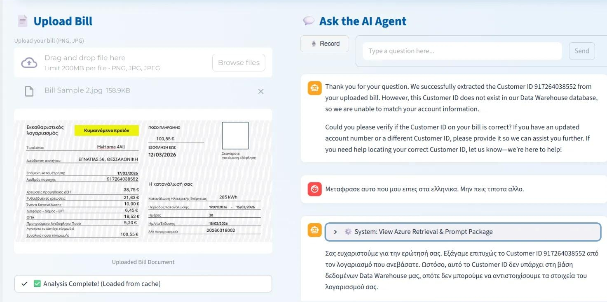

# Vision-to-RAG Prompt Builder for Energy Billing

Our team's work on the special challenge by ΔΕΗ/PPC: Vision-to-RAG Prompt Builder for Energy Billing. 

## Vision-to-RAG Prompt Builder for Energy Billing
**Special Challenge by ΔΕΗ/PPC | AI Hackathon by ACE 2026**

Developed an AI system using OCR and Retrieval-Augmented Generation + Hybrid Solutions to analyze energy bills and provide automated insights for the ACE AI Hackathon 2026.

### Technologies Used
* Python
* LangChain
* Streamlit
* RAG
* Tesseract OCR
* Azure AI Search
* FastAPI

---

# ΑΡΧΙΚΟΣ ΟΔΗΓΟΣ 

1) Clone the repo
2) Φτιαχτε ενα python virtual environment με: python -m venv venv
3) Δειτε στο pyvenv.cfg μεσα στο venv folder οτι εχετε Python 3.12.6 γιατι χρησιμοποιουμε πολλες βιβλιοθηκες που μπορει να σπανε απο εκδοση σε εκδοση.
4) Το script για να μπαινουμε στο environment ειναι: .\venv\Scripts\activate   η κατι τετοιο τελοσπαντων
5) Καντε pip install -r requirements.txt για να κατεβουν οι βιβλιοθηκες στο virtual environment. Καντε το με καινουρια εκδοση του Pip για να μην εχουμε θεμα και με αυτο
6) Επισησς φτιαχτε ενα .env αρχειο στο οποιο μεσα βαλτε τα απαιτουμενα env variables / api keys. 
7) Τρεχτε python ingest.py το οποιο ουσιαστικα φτιαχνει το Knowledge_base στο οπιιο θα βασιστει το μοντελο για την απαντηση με RAG.
8) Αν ολα πανε καλα αν τρεξετε streamlit run app.py --server.port 8888 θα αρχισει μπορειτε να δειτε το ντεμο.

# ΠΕΡΙΓΡΑΦΗ

1) Στον φακελο data/ θα εχουμε τα αρχεια με το customer database/warehouse
2) Στον φακελο knowledge_base/ θα εχουμε καποια txt / pdf κλπ. απο τα οποια το script ingest.py που βρισκεται στο root του προτζεκτ θα δημιουργει το vector database στο azure deployed vector db.
3) Το frontend και το flow της εφαρμογης ειναι στο app.py και χρησιμοποιει συναρτησεις απο τον φακελο utils/helpers.py.
4) Στο api.py τα exposed api endpoints.
